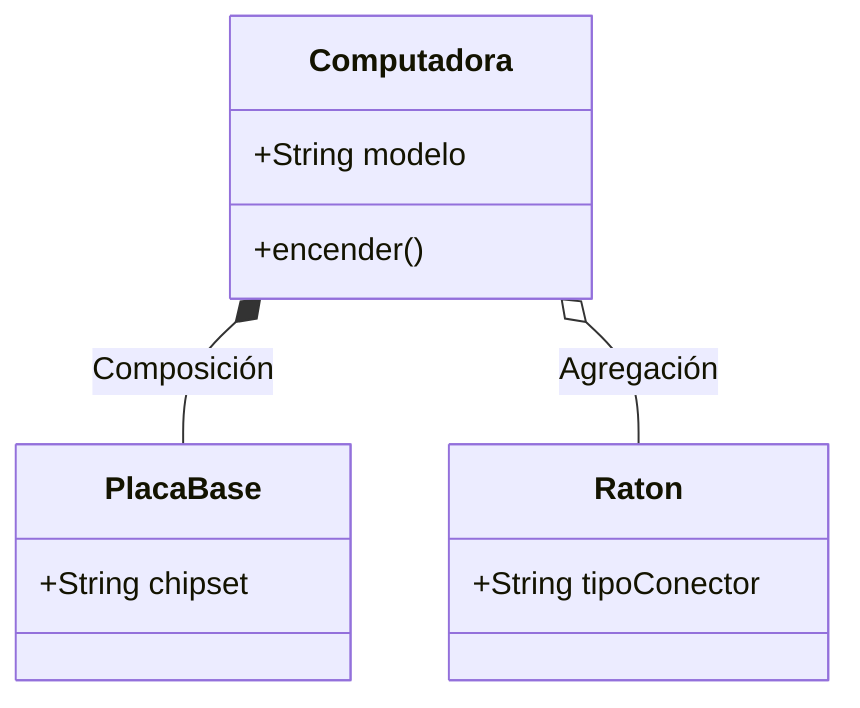
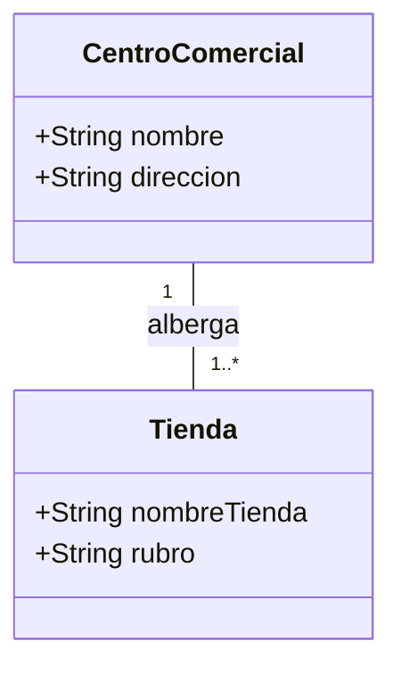
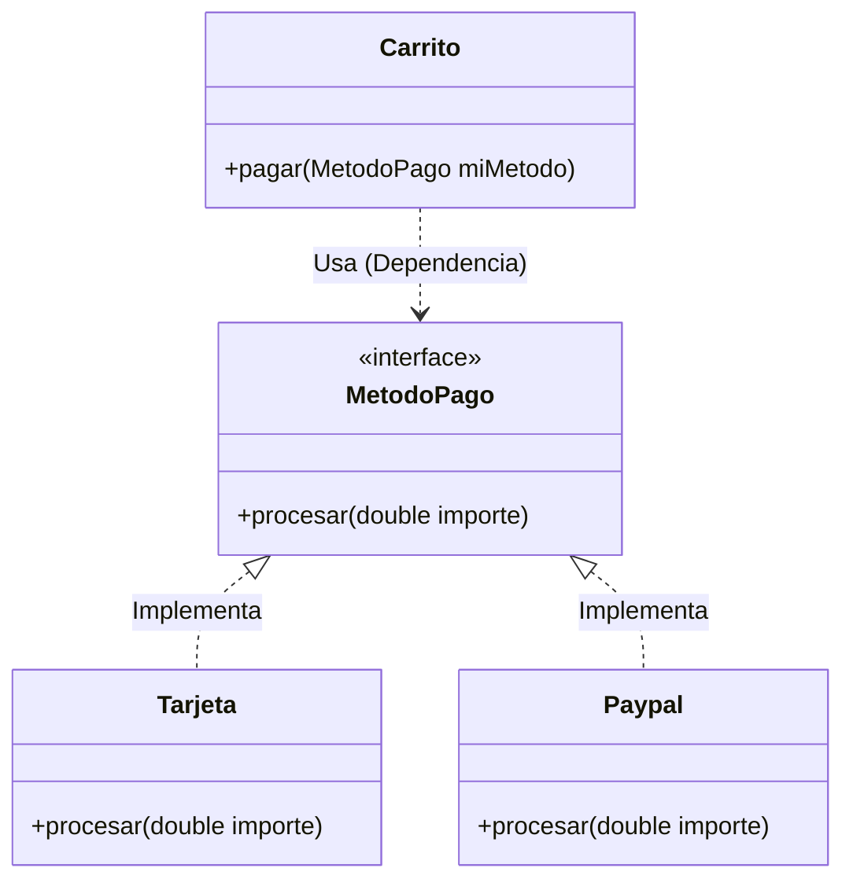
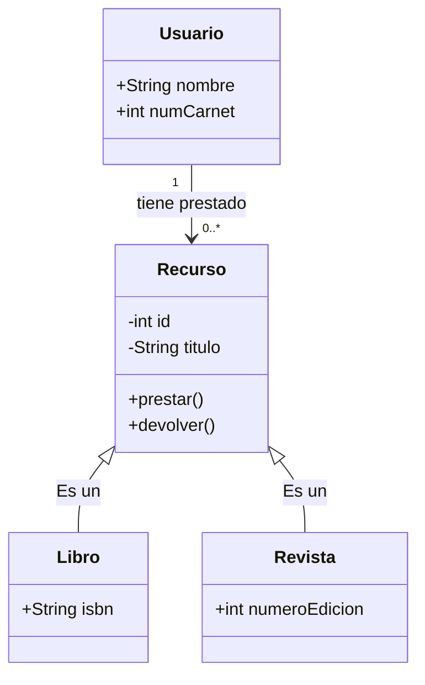

# Proyecto-Bateria-de-ejercicios-6.2
Diagrama de clases


Ejercicio 1
```mermaid
classDiagram
    class Usuario {
        -String nombreUsuario
        -String password
        +String correo
        +cambiarPassword(String nueva)
        -validarEmail()
    }
````
Ejercicio 2
```mermaid

classDiagram
    class Persona {
        +String nombre
        +String dni
    }
    class Estudiante {
        +int numeroExpediente
        +float notaMedia
    }
    Persona <|-- Estudiante

```
Ejercicio 3


Ejercicio 4


Ejercicio 5



Ejercicio 6




